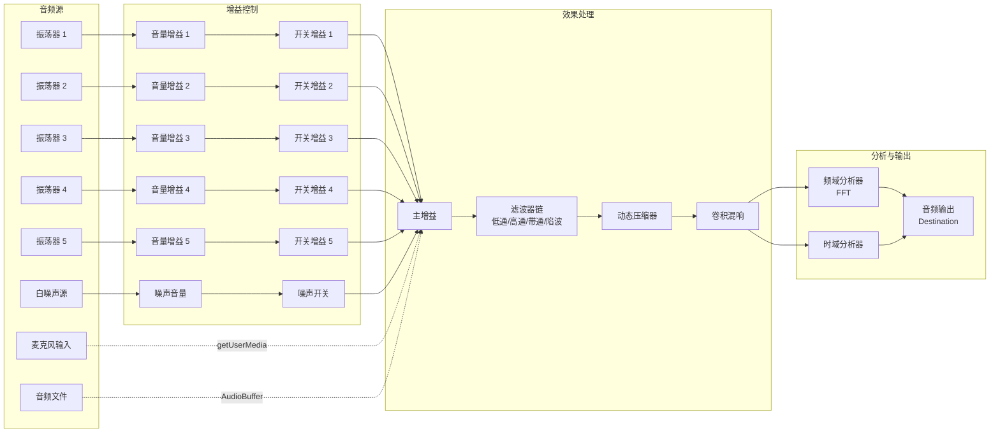
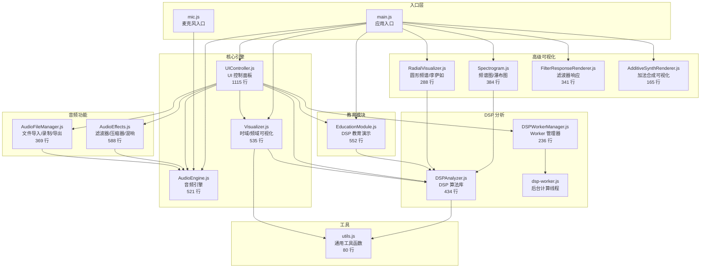
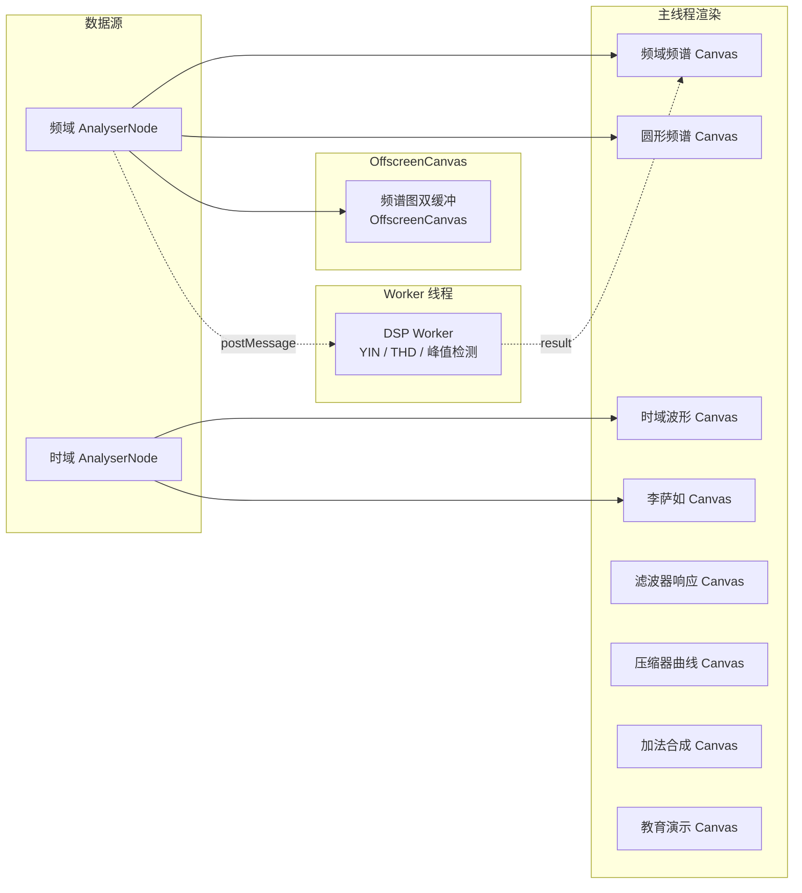

# Sound Wave Playground (SWP)

**基于 Web Audio API 的音频可视化与分析系统**

一个功能完整的数字信号处理（DSP）教学与音频可视化平台，支持实时波形生成、频谱分析、音效处理与交互式 DSP 理论演示。

[](https://royshen12.github.io/sound-wave-playground/)
[](./LICENSE)
[]()
[]()

<!-- screenshot: main-demo-overview -->

---

## 项目亮点

- **多源音频输入** -- 5 路可配置振荡器 + 白噪声 + 麦克风采集 + 音频文件导入
- **8 种可视化模式** -- 时域波形、频域频谱、频谱图/瀑布图、圆形频谱、李萨如图形、滤波器响应、压缩器曲线、加法合成谐波图
- **专业 DSP 分析** -- 窗函数、YIN 基频检测、THD 计算、RMS/Peak 电平表、频谱峰值检测
- **音效处理链** -- 滤波器链（低通/高通/带通/陷波）、动态压缩器、卷积混响、加法合成
- **交互式教育模块** -- 窗函数对比、采样定理/Nyquist 混叠、Gibbs 现象可视化
- **高性能架构** -- Web Worker 后台 DSP 计算、OffscreenCanvas 双缓冲、rAF 暂停优化
- **完善的测试体系** -- 159 单元测试 + 36 性能基准 + 11 E2E 测试，语句覆盖率 95.69%

---

## 技术栈

| 分类 | 技术 |
|------|------|
| 语言 | Vanilla JavaScript (ES Module) |
| 音频 | Web Audio API, AudioWorklet, MediaRecorder |
| 渲染 | Canvas 2D, OffscreenCanvas, devicePixelRatio 适配 |
| 构建 | Vite 7.3 |
| 单元测试 | Vitest 4.x + @vitest/coverage-v8 |
| E2E 测试 | Playwright 1.58 |
| 代码规范 | ESLint 10 + Prettier 3.8 |
| 部署 | GitHub Pages (静态) |

---

## 系统架构

### 音频信号流



### 模块依赖关系



### 渲染架构



---

## 快速开始

### 环境要求

- Node.js >= 18
- npm >= 9

### 安装与运行

```bash
# 克隆仓库
git clone https://github.com/RoyShen12/sound-wave-playground.git
cd sound-wave-playground

# 安装依赖
npm install

# 启动开发服务器（默认 http://localhost:3000）
npm run dev

# 生产构建
npm run build

# 预览构建产物
npm run preview
```

### 测试

```bash
# 运行单元测试
npm test

# 监听模式
npm run test:watch

# 生成覆盖率报告
npm run test:coverage

# 运行 E2E 测试（需先安装 Playwright 浏览器）
npx playwright install
npm run test:e2e
```

### 代码质量

```bash
# ESLint 检查
npm run lint

# ESLint 自动修复
npm run lint:fix

# Prettier 格式化
npm run format
```

---

## 项目结构

```
sound-wave-playground/
├── index.html                  # 主页面（振荡器演示）
├── MIC.html                    # 麦克风分析页面
├── package.json                # 项目配置与依赖
├── vite.config.js              # Vite 构建配置
├── vitest.config.js            # Vitest 测试配置
├── playwright.config.js        # Playwright E2E 配置
├── eslint.config.js            # ESLint 代码规范配置
├── .prettierrc                 # Prettier 格式化配置
├── LICENSE                     # MIT License
│
├── src/                        # 源代码（约 6177 行 JS）
│   ├── main.js                 # 振荡器演示入口
│   ├── mic.js                  # 麦克风分析入口
│   ├── AudioEngine.js          # 音频引擎核心
│   ├── Visualizer.js           # 时域/频域可视化
│   ├── UIController.js         # UI 控制面板
│   ├── DSPAnalyzer.js          # DSP 分析算法库
│   ├── DSPWorkerManager.js     # Web Worker 管理
│   ├── Spectrogram.js          # 频谱图/瀑布图
│   ├── RadialVisualizer.js     # 圆形频谱/李萨如
│   ├── AudioEffects.js         # 音效处理链
│   ├── AudioFileManager.js     # 文件导入/录制/导出
│   ├── EducationModule.js      # DSP 教育演示
│   ├── FilterResponseRenderer.js  # 滤波器响应可视化
│   ├── AdditiveSynthRenderer.js   # 加法合成可视化
│   ├── utils.js                # 通用工具函数
│   └── styles.css              # DAW 风格深色主题
│
├── public/                     # 静态资源
│   ├── dsp-worker.js           # DSP Web Worker 线程
│   └── audio-worklet-processor.js  # AudioWorklet 处理器
│
├── tests/                      # 测试文件
│   ├── DSPAnalyzer.test.js     # DSP 分析器单元测试
│   ├── utils.test.js           # 工具函数单元测试
│   ├── EducationModule.test.js # 教育模块单元测试
│   └── benchmark.test.js       # 性能基准测试
│
├── e2e/                        # E2E 测试
│   └── app.spec.js             # 端到端测试用例
│
├── coverage/                   # 测试覆盖率报告
└── dist/                       # 构建产物
```

---

## 核心模块说明

### AudioEngine.js -- 音频引擎

音频系统的核心，管理完整的 Web Audio API 音频图。

- **AudioContext 生命周期管理** -- 创建、挂起、恢复、销毁
- **5 路振荡器** -- 独立频率、音量、波形（正弦/方波/锯齿/三角）控制
- **白噪声生成器** -- AudioBuffer 填充随机采样值
- **增益节点网络** -- 音量增益 + 开关增益 + 主增益三级结构
- **双分析器** -- 独立的时域和频域 AnalyserNode（可配置 FFT 大小 256~16384）
- **外部音频源接口** -- 支持接入 AudioFileManager 和麦克风输入
- **AudioWorklet 支持** -- 优先使用 AudioWorklet，不支持时自动回退 ScriptProcessorNode

### Visualizer.js -- 波形可视化

时域和频域的实时 Canvas 渲染引擎。

- **时域波形** -- 三种绘制模式（采样点、填充区域、连续波形）
- **频域频谱** -- 垂直柱状图 + 对数频率轴 + dB 刻度
- **频谱标注** -- 峰值频率自动检测与标注、音符名称显示
- **电平表** -- RMS/Peak 电平指示器（含峰值保持和衰减动画）
- **高 DPI 适配** -- devicePixelRatio 自动缩放
- **自适应尺寸** -- ResizeObserver 监听容器变化

### UIController.js -- UI 控制面板

动态生成全部用户界面控件。

- **振荡器面板** -- 频率滑块、音量旋钮、波形选择、开关控制
- **滤波器面板** -- 类型选择、截止频率、Q 值、增益参数
- **压缩器面板** -- 阈值/拐点/压缩比/起始/释放五参数控制
- **文件操作面板** -- 导入、录制、下载、拖拽上传
- **加法合成面板** -- 8 路谐波幅度滑块 + 预设波形
- **教育模块面板** -- 演示选择、参数控制、预设场景

### DSPAnalyzer.js -- DSP 分析算法库

纯函数式设计的数字信号处理算法集合。

- **窗函数** -- Hamming、Hanning、Blackman、Kaiser（含 I0 贝塞尔函数）
- **基频检测** -- 自相关法 + YIN 算法（累积均值归一化差分）
- **频谱分析** -- 峰值检测（抛物线插值）、对数频率映射
- **音高识别** -- 频率 -> 音符名 + 八度 + 音分偏差
- **失真分析** -- THD 总谐波失真计算
- **电平测量** -- RMS 均方根电平、Peak 峰值电平

### AudioEffects.js -- 音效处理

可插拔的音频效果处理链。

- **滤波器链** -- 支持多个串联 BiquadFilterNode（低通/高通/带通/陷波）
- **旁通架构** -- 干/湿信号独立路径，支持效果器旁通
- **动态压缩器** -- DynamicsCompressorNode 包装，5 参数全控制
- **卷积混响** -- ConvolverNode 加载脉冲响应（IR）文件
- **加法合成** -- 8 谐波独立控制，PeriodicWave 实时更新

### AudioFileManager.js -- 音频文件管理

音频输入输出的完整解决方案。

- **文件导入** -- 支持 MP3/WAV/OGG 格式，FileReader + decodeAudioData
- **拖拽上传** -- HTML5 Drag & Drop API
- **音频录制** -- MediaRecorder API 实时录制
- **WAV 导出** -- 手动编码 WAV 文件头 + PCM 数据

### EducationModule.js -- DSP 教育演示

交互式数字信号处理理论教学模块。

- **窗函数对比** -- 同时显示时域窗函数形状和频域旁瓣特性
- **采样定理演示** -- 可调信号频率和采样率，直观展示 Nyquist 混叠现象
- **Gibbs 现象** -- 傅里叶级数逼近方波，可调谐波项数观察过冲
- **预设场景库** -- 正弦波、和弦、白噪声、谐波、拍频、八度等一键加载

---

## 可视化类型一览

| 可视化类型 | 模块 | 说明 |
|-----------|------|------|
| 时域波形 | Visualizer | 实时音频波形，三种绘制模式 |
| 频域频谱 | Visualizer | FFT 频率分布柱状图，对数轴 + dB 刻度 |
| 频谱图/瀑布图 | Spectrogram | 时间-频率-幅度热力图（三种配色） |
| 圆形频谱 | RadialVisualizer | 径向排列的频率幅度图 |
| 李萨如图形 | RadialVisualizer | 左右声道相位关系声场图 |
| 滤波器响应 | FilterResponseRenderer | 滤波器频率响应曲线（对数频率轴） |
| 压缩器曲线 | FilterResponseRenderer | 输入/输出 dB 关系与拐点过渡 |
| 加法合成图 | AdditiveSynthRenderer | 谐波柱状图 + 合成波形预览 |

<!-- screenshot: visualization-types-grid -->

---

## DSP 算法列表

| 算法 | 方法 | 用途 |
|------|------|------|
| Hamming 窗 | `applyHammingWindow()` | 减少频谱泄漏 |
| Hanning 窗 | `applyHanningWindow()` | 减少频谱泄漏 |
| Blackman 窗 | `applyBlackmanWindow()` | 高旁瓣抑制 |
| Kaiser 窗 | `applyKaiserWindow()` | 可调旁瓣衰减 |
| YIN 基频检测 | `detectPitchYIN()` | 精确音高检测 |
| 自相关法 | `detectPitchAutocorrelation()` | 基础音高检测 |
| 频谱峰值检测 | `detectPeaks()` | 主要频率成分识别 |
| 抛物线插值 | `parabolicInterpolation()` | 峰值频率精化 |
| THD 计算 | `calculateTHD()` | 谐波失真评估 |
| RMS 电平 | `calculateRMS()` | 均方根功率测量 |
| Peak 电平 | `calculatePeak()` | 瞬时峰值测量 |
| 对数频率映射 | `logFrequencyScale()` | 频率轴对数化 |
| 频率-音符映射 | `frequencyToNote()` | 音高识别与标注 |

---

## 性能数据

基于 Vitest 性能基准测试（36 个用例）：

| 指标 | 数值 |
|------|------|
| 完整分析管线（4096 样本） | ~0.5 ms/帧 |
| 30 fps 帧预算占比 | ~1.6% |
| 单元测试数量 | 159 |
| 性能基准数量 | 36 |
| E2E 测试数量 | 11 |
| 语句覆盖率 (Statements) | 95.69% |
| 函数覆盖率 (Functions) | 95.45% |
| 行覆盖率 (Lines) | 95.42% |

### 性能优化策略

- **Web Worker** -- DSP 密集计算（YIN、THD、峰值检测）卸载到后台线程，避免阻塞主线程渲染
- **OffscreenCanvas** -- 频谱图使用双缓冲渲染，减少主线程 Canvas 操作
- **rAF 暂停** -- 页面不可见时自动暂停 requestAnimationFrame 循环
- **内存管理** -- AudioEngine.destroy() 和 Visualizer.destroy() 完整释放所有资源，防止内存泄漏

---

## 浏览器兼容性

| 浏览器 | 支持状态 | 备注 |
|--------|---------|------|
| Chrome 66+ | 完全支持 | 推荐浏览器 |
| Firefox 76+ | 完全支持 | |
| Edge 79+ | 完全支持 | Chromium 内核 |
| Safari 14.1+ | 基本支持 | webkitAudioContext 兼容 |

> **注意事项：**
> - 浏览器自动播放策略要求用户交互后才能初始化 AudioContext
> - 麦克风功能需要 HTTPS 或 localhost 环境
> - OffscreenCanvas 和 AudioWorklet 在不支持的浏览器中自动回退

---

## License

[MIT License](./LICENSE) - Copyright (c) 2019 RoyShen12
